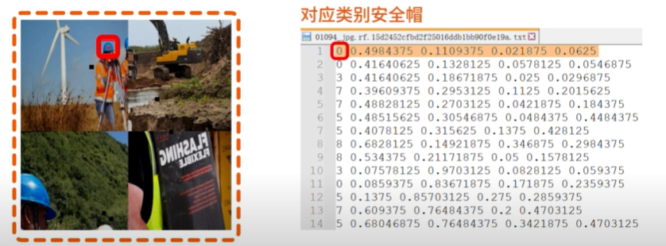
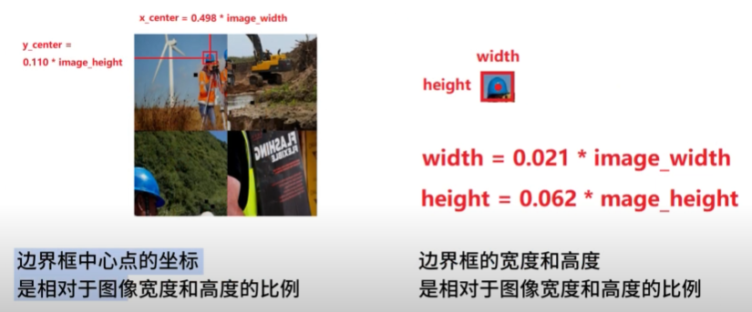

# Safety-helmet-detection
基于yolo的安全帽识别的目标检测模型

## 基础环境
- yolo8.2
- conda
- python3.10

## 训练数据来源
https://www.kaggle.com/datasets/snehilsanyal/construction-site-safety-image-dataset-roboflow?resource=download

- css-data/test  测试数据
- css-data/train 训练数据
- css-data/valid 验证数据

标记的数据

第0列: class_id: 类型编号
第1列: x_center: 边界框中心点x坐标
第2列: y_center: 边界框中心点y坐标
第3列: width: 边界框的宽度
第4列: height: 边界框的高度

``` 
8 0.790625 0.6828125 0.17421875 0.2625
9 0.7421875 0.1984375 0.125 0.29296875
0 0.58046875 0.38203125 0.01640625 0.0140625
5 0.5828125 0.45390625 0.03515625 0.15859375
7 0.3015625 0.49296875 0.02421875 0.05625
7 0.20234375 0.60859375 0.02421875 0.0390625
7 0.16171875 0.628125 0.02734375 0.06015625
7 0.1875 0.67421875 0.028125 0.06171875
0 0.16171875 0.57890625 0.01640625 0.01796875
0 0.203125 0.56953125 0.0171875 0.021875
0 0.3015625 0.44375 0.01484375 0.0203125
5 0.3015625 0.5203125 0.03125 0.178125
5 0.20234375 0.64375 0.02734375 0.17109375
5 0.18828125 0.703125 0.05 0.1703125
5 0.159375 0.66015625 0.0359375 0.1828125
```



